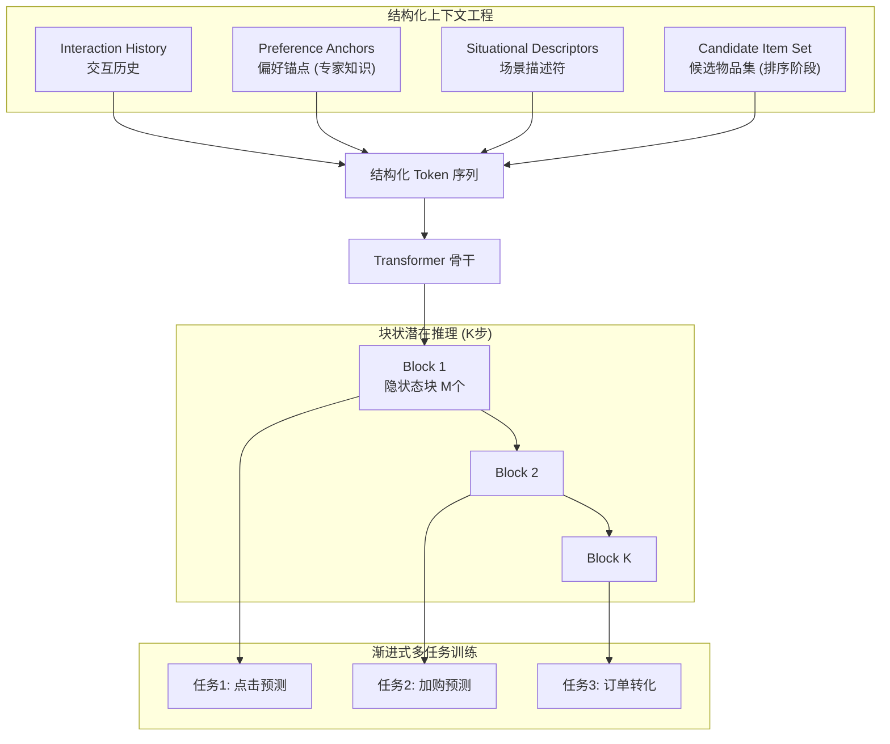

# OnePiece: Bringing Context Engineering and Reasoning to Industrial Cascade Ranking System

- **arXiv ID**: 2509.18091
- **原始链接**: [arXiv](https://arxiv.org/abs/2509.18091)
- **作者**: Sunhao Dai, Jiakai Tang, Jiahua Wu 等（16人）
- **机构**: 人大 + Shopee + 中科大 + 新加坡国立大学
- **发布时间**: 2025-09-22
- **学科分类**: cs.IR, cs.AI, cs.CL
- **本地PDF**: PDF（未公开）
- **代码**: （待查）
- **评级**: （待评）
- **我的评语**: （待评）

## 一句话总结

首次将 LLM 的核心机制（上下文工程 + 多步推理）成功引入并部署到千万级工业级级联排序系统（搜索推荐），提出偏好锚点、块状推理、渐进式训练三大创新，线上 GMV/UU +2%+。

## 可信度与工程价值分析

| 维度 | 评估 | 说明 |
|------|------|------|
| 机构属性 | 学术界 + 工业界 | 人大/Shopee/中科大/新加坡国立大学联合，Shopee 已线上部署 |
| 数据集规模 | 超大 | Shopee 主搜 30 天日志，1000万用户，9300万商品 |
| 代码开源 | 待查 | arXiv 页面未提供（技术报告） |
| 实验可信度 | 高 | 离线 + 线上 A/B 测试双重验证 |
| 潜在问题 | 排序阶段线上是降级版本（M=1，退化为 Pointwise）；特征裁剪 |

## 论文要解决什么问题

### 背景
- LLM 成功不仅源于 Transformer 架构，更源于两个互补机制：**上下文工程**（丰富输入 Prompt）和**多步推理**（CoT 思维链）
- 现有工业界尝试仅移植 Transformer 架构，相比高度优化的 DLRM 只带来增量改进

### 核心挑战
1. **输入端**：传统推荐输入是原始交互序列，缺乏 LLM Prompt 的结构化丰富性
2. **监督端**：LLM 有大量 CoT 文本标注，但推荐场景缺乏天然监督信号（专家无法描述用户潜在心理路径）

### 论文切入点
- 将**上下文工程**引入推荐输入：构建结构化 Token 序列
- 将**多步推理**引入模型架构：块状潜在推理 + 渐进式训练

## 核心思路

OnePiece 统一框架，纯 Transformer 骨干，覆盖检索 + 排序两端：

## 数据流转详解

### 输入序列构建（上下文工程）

1. **Interaction History (IH)**：按时间排序的用户历史行为序列
2. **Preference Anchors (PA)**：**关键创新**！基于专家知识构建的辅助物品序列（如当前 query 下点击率 Top-k 物品），类似 LLM 的外部知识注入
3. **Situational Descriptors (SD)**：用户画像 + query 特征
4. **Candidate Item Set (CIS)**：排序阶段采用**分组集合式 (Grouped setwise)**，候选集切分为大小 C 的小组同时输入，实现候选间交叉比较

### 块状潜在推理

**动机**：解决传统单向量推理的"带宽瓶颈"

- 传统做法循环单个隐状态进行多步推理，但单个向量容量有限，信号被过度压缩
- Block-wise 提供可调节的推理带宽（M 个向量组成的块），不同 Token 可承担不同"专业角色"

> 论文原文："single-unit reasoning suffers from narrow bandwidth... leading to signal compression and information loss."

**Block Size M 的设计原理**：

| 阶段 | M 取值 | 原因 |
|------|--------|------|
| 检索 | M = SD 长度（用户 Token + Query Token） | 对用户兴趣和 Query 意图联合强化 |
| 排序 | M = C（候选商品组大小，如 12） | 候选组作为一个块，实现集合内交互对比 |

**关键设计**：排序阶段把候选组作为一块，模型能在共享潜空间中**直接对比不同候选者的优劣**——这是真正的 Listwise/Setwise 排序。

> 论文原文："enabling the model to capture cross-candidate interactions for more accurate score prediction."

**线上妥协**：排序线上部署是**降级版本**（M=1），因为 M=C 的完全体计算成本过高。

### 渐进式多任务训练

- 利用用户反馈行为链（曝光 → 点击 → 加购 → 购买）作为渐进监督
- **课程学习**：前期推理步骤优化简单任务（点击），后期优化复杂任务（订单）

**召回阶段 Loss 设计**：

| Loss 类型 | 具体形式 | 作用 |
|-----------|----------|------|
| 点态 Loss | Binary Cross-Entropy (BCE) | 校准概率估计 |
| 对比 Loss | Bidirectional Contrastive Learning (BCL) | 批次级别全局对比建模 |

> **不是 NTP！** 召回用判别式 Loss（用户表征 $r_k$ 与商品表征 $z_v$ 内积相似度），而非生成式的 next token prediction。

**BCL 双向对比学习**（模仿 CLIP）：
- **U2I**：用户表征从候选池识别正向商品
- **I2U**：正向商品在全批次用户中找到对应用户

> 总 Loss：$\mathcal{L}_{retrieval} = \sum_{k=1}^K (\mathcal{L}_{BCE}^k + \mathcal{L}_{BCL}^k)$

**排序阶段 Loss**：集合对比学习 SCL（Set-wise Contrastive Learning）

## 实验设置与结果

- **数据集**：Shopee 主搜 30 天线上日志
- **Baselines**：DLRM（Shopee 生产基线）、HSTU（Meta）、ReaRec
- **指标**：检索 Recall@100/500；排序 Click/Add/Order AUC/GAUC

### 主要发现

1. **全面领先**：所有指标超越 DLRM 和 Transformer 基线
2. **Scaling Law**：数据增至 60 天，DLRM/HSTU 快速瓶颈，OnePiece 持续线性增长
3. **消融**：偏好锚点使点击 AUC +0.109；多步推理进一步提升排序
4. **线上 A/B**：检索 +1.08% GMV/UU；排序 +1.12% GMV/UU，广告收入 +2.90%

## 前置工作 / 相关工作

| 工作 | 简介 | arXiv | 知识库 |
|------|------|-------|-------|
| HSTU | Meta 生成式推荐框架 | - | - |
| ReaRec | 推理增强序列推荐 | - | - |
| DLRM | 传统深度学习推荐模型 | - | - |

## 亮点与局限

### 亮点
1. **开创性应用**：首次成功部署 LLM 机制到千万级级联排序系统
2. **偏好锚点**：巧妙引入领域先验知识作为"Prompt"，极大提升场景理解
3. **行为链替代 CoT**：用用户递进式行为作为课程学习天然标签

### 局限
1. 排序线上是**降级版本**：M=1（退化为 Pointwise），特征裁剪
2. Setwise 完全体线上成本过高，需底层算子优化
3. 组大小 C 和推理步数 K 需精细调参

## 对后续研究的启发

1. **特征工程 → 上下文工程**：推荐特征工程应转向结构化 Prompt 构建
2. **行为链替代思维链**：无自然语言场景可利用递进式行为监督
3. **系统工程协同**：KV Caching、算子优化让 Setwise 排序低成本落地

## 术语表

| 术语 | 英文 | 解释 |
|------|------|------|
| Context Engineering | 上下文工程 | 将异构信号转化为结构化 Token 序列，类似 LLM Prompt |
| Preference Anchors | 偏好锚点 | 基于专家知识的辅助物品序列，作为外部知识注入 |
| Block-wise Reasoning | 块状推理 | 每步生成 M 个隐状态的"块"，实现多步迭代细化 |
| Grouped Setwise | 分组集合式 | 候选集切分为小组同时输入，实现候选间交叉比较 |
| Curriculum Learning | 课程学习 | 先学简单任务后学复杂任务的训练策略 |
| GMV/UU | - | 每用户平均交易额（核心电商指标） |

## 原始摘要

Despite the growing interest in replicating the scaled success of large language models (LLMs) in industrial search and recommender systems, most existing industrial efforts remain limited to transplanting Transformer architectures, which bring only incremental improvements over strong Deep Learning Recommendation Models (DLRMs). From a first principle perspective, the breakthroughs of LLMs stem not only from their architectures but also from two complementary mechanisms: context engineering, which enriches raw input queries with contextual cues to better elicit model capabilities, and multi-step reasoning, which iteratively refines model outputs through intermediate reasoning paths. However, these two mechanisms and their potential to unlock substantial improvements remain largely underexplored in industrial ranking systems. In this paper, we propose OnePiece, a unified framework that seamlessly integrates LLM-style context engineering and reasoning into both retrieval and ranking models of industrial cascaded pipelines...

## 插图引用

> 核心图表来自 LaTeX 源文件渲染，以下为关键图表分析：

### 图 1: OnePiece 整体架构图（核心）
OnePiece 整体架构（未公开）

**分析**：这是论文最核心的架构图，展示了 OnePiece 统一框架如何将召回（Retrieval Mode）和排序（Ranking Mode）集成在一个框架内。

**关键模块**：
- **输入层**：Interaction History (IH)、Preference Anchors (PA)、Situational Descriptors (SD)、Candidate Item Set (CIS)
- **核心层**：OnePiece Transformer 骨干网络（召回和排序共享参数）
- **渐进式推理**：通过 Reasoning Position Embedding 实现多步推理循环，生成 Logits_Step1 和 Logits_Step2
- **多步监督**：右侧 Progressive Multi-Task Reasoning Loss 对每个推理步骤进行监督

**三大创新标注**：
1. Unified Model - 打破召回和排序模型互不相通的传统
2. Progressive Reasoning - 引入推理位置编码，模拟"初步筛选 → 深入思考 → 最终决策"
3. Multi-Step Supervision - 对推理的每个中间步骤都进行监督

### 图 2: LLM vs OnePiece 对比图
LLM vs OnePiece（未公开）

**分析**：展示了 OnePiece 如何借鉴 LLM 的上下文工程和推理机制：
- **左侧 LLM**：Query + Context + External Knowledge → 显式推理（CoT）或隐式推理
- **右侧 OnePiece**：Interaction History + Context + Reference Knowledge → Block-wise Reasoning（分块推理）
- **核心概念**：从"简单评分"到"逻辑推理"的演进

### 图 3: Tokenizer 结构图
Tokenizer（未公开）

**分析**：展示了如何将异构特征统一转化为 Token 序列：

**输入分类**：
- **蓝色**：Interaction History（历史行为：Stat Feat, Cate ID, Shop ID, Item ID）
- **黄色**：Preference Anchors（Top-k 已购买/已点击商品，包裹在 BOS/EOS 间）
- **绿色**：Situational Descriptors（用户画像 + Query 信息）
- **紫色**：Candidate Item Set（仅排序模式，候选商品特征）

**处理流程**：
- Shared Embedding Layer → Concat & MLP → Position Embedding → Token Sequence
- 排序模式在检索模式基础上额外拼接候选商品 Token

### 图 4: 推理注意力热图
推理注意力（未公开）

**分析**：展示两种模式下的推理注意力机制差异：

**(a) Retrieval Mode**：
- $R_1$ 对 I 和 P 分散关注
- $R_2$ 高度关注 $R_1$（链式推理）
- 模型结合原始背景和上一步推理

**(b) Ranking Mode**：
- $R_1, R_2, R_3$ 几乎不关注 I 和 P
- 注意力集中在推理步骤自身
- 自闭环式，用于评估逻辑链质量

### 图 5: 训练收敛对比图
训练收敛（未公开）

**分析**：展示 OnePiece 的数据可扩展性（Data Scalability）：

**左图 Retrieval Mode (Recall@100)**：
- DLRM/HSTU 在 10-20 天后快速进入平台期（DLRM ~0.46, HSTU ~0.48）
- OnePiece 持续线性增长，60 天时达到 ~0.54

**右图 Ranking Mode (Click AUC)**：
- DLRM ~0.86, HSTU ~0.87 早早饱和
- OnePiece 从最低点快速攀升，60 天时超过 0.92

**核心结论**：OnePiece 能持续从更大规模数据中学习，而传统模型遇到瓶颈

---

## 复查记录

- 2026-04-15 14:13 CST: 初始化论文并生成完整笔记
