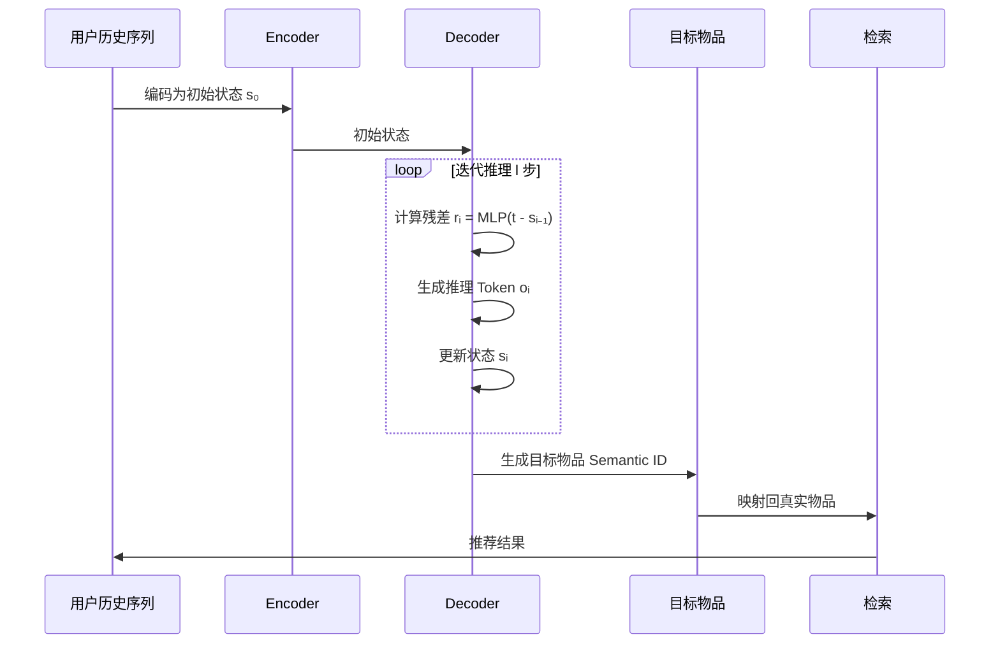

# Slow Thinking for Sequential Recommendation

- **arXiv ID**: 2504.09627v1
- **原始链接**: [arXiv](https://arxiv.org/abs/2504.09627v1)
- **作者**: Junjie Zhang, Beichen Zhang, Wenqi Sun, Hongyu Lu, Wayne Xin Zhao, Yu Chen, Ji-Rong Wen
- **机构**: 人大
- **发布时间**: 2025-04-13
- **学科分类**: cs.IR, cs.AI
- **代码**: [GitHub](https://github.com/RUCAIBox/STREAM-Rec)（待验证）
- **评级**: #rating/NPC
- **我的评语**: 预测RqToken，取了个花哨的名字，有点偏玩具

## 一句话总结

本文提出 **STREAM-Rec**，一种将"慢思考"范式引入序列推荐的新方法。通过**三阶段训练框架**（预训练→迭代推理微调→强化学习），让传统推荐模型逐步生成推理过程，而非一步匹配，显著提升了推荐准确性。在 Amazon 数据集上相比基线提升 **10-20%**。

## 可信度分析

| 维度 | 评估 | 说明 |
|------|------|------|
| 机构属性 | 学术界 | 人大高瓴人工智能学院 |
| 数据集规模 | 中等 | Instruments (57K序列, 24K物品), Scientific (51K序列, 26K物品)，属于细分领域数据集 |
| 代码开源 | 已开源 | GitHub: RUC-AIBox/STREAM-Rec ✅ |
| 实验可信度 | 中等 | 消融实验较充分，但仅在 2 个数据集上验证，域外泛化性待考察 |
| 潜在问题 | | 1) 推理步数需调参，不同数据集最优步数不同 2) 多步推理增加延迟，实时性场景不友好 3) 预训练阶段反而降低性能，需精心设计合成数据 |

## 论文要解决什么问题

### 研究背景

序列推荐（Sequential Recommendation）通过建模用户历史行为的时序关系来预测下一个物品，是电商、流媒体、新闻平台的核心技术。现有方法（RNN、CNN、Transformer）虽技术各异，但都遵循**"快思考"范式**：

```
用户历史 → 编码器 → 用户表示 → 直接匹配候选物品 → 推荐
```

### 现有方法的短板

1. **一步推理的局限**：小模型难以在单步内精确捕捉用户偏好、物品特征及其匹配关系
2. **表示学习压力大**：推荐性能完全依赖于表示学习质量，对小模型是巨大挑战
3. **缺乏推理深度**：无法像人类一样"深思熟虑"，逐步分析历史行为再下结论

### 论文的切入点

借鉴大语言模型中的 **Test-time Scaling** 和 **Slow Thinking** 思想，提出核心问题：

> **能否通过激发传统推荐系统的推理能力来提升性能？**

## 核心思路

### 关键洞察

不同于数学题或代码题有明确的逻辑步骤，推荐系统的"推理"需要重新定义。本文提出：**通过迭代修正残差来生成推理路径**。

### STREAM-Rec 架构

整体框架（未公开）

> STREAM-Rec 的三阶段训练框架。Stage 1 预训练学习行为模式；Stage 2 通过迭代推理生成慢思考数据并微调；Stage 3 使用强化学习进一步优化推理策略。

## 方法细拆

### 1. 生成式推荐基础

**传统匹配推荐**：
$$P(\hat{i}_{n+1}|{i_1, \cdots, i_n})$$

**生成式推荐（本文基础）**：
- 使用 RQ-VAE 将物品文本表示量化为语义代码（Semantic ID）
- 用户行为序列 → Token 序列
- 模型自回归生成未来 Token 表示目标物品

### 2. Stage 1: 预训练（Pretraining）

**目标**：学习通用行为模式，支持长程依赖

**关键技巧 - 数据合成**：
- 问题：直接生成目标物品 Token，输出长度受限（仅 tokenizer 长度 m）
- 解决：检索与目标物品表示相似的物品，拼接其 Token 延长目标序列

$$Y = [\underbrace{c'_1,\ldots, c_q'}_{相似物品Token}; \underbrace{c_{p+1}, \ldots, c_{p+m+1}}_{目标物品Token}]$$

**损失函数**：标准序列到序列的交叉熵损失

### 3. Stage 2: SFT - 慢思考微调 ⭐核心

#### 3.1 迭代推理数据收集

迭代推理过程（未公开）

> SFT 阶段的迭代推理机制。模型通过计算残差（目标与当前预测的差距），逐步生成推理 Token，修正预测，最终逼近目标物品表示。

**核心思想**：通过计算和拟合**残差**逐步逼近目标

**Step 1 - 伪标签生成**：
- 当前状态：$\bm{s}_{i-1}$
- 目标表示：$\bm{t}$
- 残差：$\bm{r}_i = \textit{MLP}(\bm{t} - \bm{s}_{i-1})$
- 选择最接近残差的 Token 作为伪标签：$o_i = \arg\min_{c_k} \| \bm{c}_k - \bm{r}_i \|$

**Step 2 - 状态更新**：
- 聚合所有步骤的贡献：$\bm{s}_i = \textit{MLP}(\sum_{j=0}^{i}\bm{d}_j)$
- 计算新残差：$\bm{r}_{i+1} = \textit{MLP}(\bm{t} - \bm{s}_i)$

**最终标签序列**：
$$Y = [\underbrace{o_1, o_2, \ldots, o_l}_{推理过程}; \underbrace{c_{p+1}, \ldots, c_{p+m+1}}_{目标物品}]$$

#### 3.2 训练策略

**多损失联合优化**：
1. **State-Target 对比损失**：让预测状态逐步收敛到目标表示
2. **量化损失**：对齐残差表示与量化 Token
3. **SFT 损失**：标准序列生成损失
4. **DPO 损失**：与直接推荐模型对比，增强慢思考能力

### 4. Stage 3: 强化学习优化

**算法**：GRPO (Group Relative Policy Optimization)

**奖励设计**：
- **格式奖励**：解析错误的惩罚
- **精确匹配奖励**：生成 Token 与目标 Token 的连续匹配度
- **相似度奖励**：预测状态与目标表示的相似度
- **思考似然奖励**：基于推理过程生成目标的似然度 vs 直接生成
- **思考排序奖励**：正样本在负样本中的排序位置

## 数据流转详解

> 从输入到输出的完整路径，涵盖训练和推理两个阶段。

### 训练阶段

1. **输入**：用户历史行为序列 `{i₁, i₂, ..., iₙ}` + 目标物品 `i_{n+1}`
2. **RQ-VAE 编码**：将物品文本描述编码为 Semantic ID（离散 Token 序列）
3. **预训练阶段**：学习通用行为模式，支持长程依赖
   - 合成目标序列：检索相似物品 Token + 目标物品 Token
   - 训练 Seq2Seq 模型
4. **SFT 阶段**（核心）：
   - 计算残差：`rᵢ = MLP(t - s_{i-1})`，其中 t 是目标表示，s 是当前状态
   - 生成推理 Token：`oᵢ = argmin ||c_k - rᵢ||`
   - 更新状态：`sᵢ = MLP(Σⱼ dⱼ)`
   - 迭代 l 步（Instruments: 6步，Scientific: 4步）
5. **RL 阶段**：GRPO 优化推理策略
   - 多奖励联合优化：格式 + 匹配 + 相似度 + 似然 + 排序
6. **输出**：训练好的推荐模型

### 推理阶段

1. **输入**：用户历史行为序列 `{i₁, i₂, ..., iₙ}`
2. **编码**：RQ-VAE 编码用户历史为初始状态 `s₀`
3. **迭代推理**（l 步）：
   - 对每步 i：计算残差 → 生成推理 Token → 更新状态
4. **生成**：自回归生成目标物品的 Semantic ID
5. **检索**：将 Semantic ID 映射回真实物品
6. **输出**：推荐物品列表



## 实验设置与结果

### 数据集

| 数据集 | 序列数 | 物品数 | 交互数 | 平均长度 | 稀疏度 |
|--------|--------|--------|--------|----------|--------|
| Instruments | 57,349 | 24,587 | 511,836 | 7.37 | 99.96% |
| Scientific | 50,985 | 25,848 | 412,947 | 8.10 | 99.97% |

### Baseline

- **传统方法**：Caser (CNN), GRU4Rec (RNN), SASRec, BERT4Rec (Transformer)
- **生成式方法**：TIGER（本文对比基线，同为生成式但无推理过程）

### 评估指标

- HR@5, HR@10 (Recall)
- NDCG@5, NDCG@10

### 主结果

| 方法 | Instruments R@10 | Scientific R@10 | 提升 |
|------|------------------|-----------------|------|
| TIGER (基线) | 0.0532 | 0.0382 | - |
| STREAM-Rec$_{SFT}$ | 0.0562 | 0.0390 | +5.6% / +2.1% |
| **STREAM-Rec$_{RL}$** | **0.0608** | **0.0424** | **+14.3% / +11.0%** |

**关键发现**：
1. 传统方法表现较差（一步推理局限）
2. 预训练后性能下降（低质量合成推理数据）
3. SFT 后显著提升（高质量迭代推理数据）
4. RL 进一步优化（探索更多推理模式）

## 前置工作 / 相关工作

| 工作 | 简介 | arXiv | 知识库 |
|------|------|-------|-------|
| **TIGER** | 生成式序列推荐，使用 Semantic ID + Seq2Seq 生成未来物品 | [arXiv:2308.04637](https://arxiv.org/abs/2308.04637) | （待添加） |
| **SASRec** | 自注意力机制建模用户行为序列，Transformer 架构 | [arXiv:2108.09040](https://arxiv.org/abs/2108.09040) | （待添加） |
| **BERT4Rec** | 双向 Transformer + MLM 预训练，引入遮蔽语言模型 | [arXiv:1904.06690](https://arxiv.org/abs/1904.06690) | （待添加） |
| **GRU4Rec** | GRU 网络建模用户行为序列时序依赖 | [arXiv:1803.09587](https://arxiv.org/abs/1803.09587) | （待添加） |
| **Caser** | CNN 卷积捕捉高阶 Markov 模式 | - | （待添加） |
| **RQ-VAE** | 残差量化变分自编码器，学习离散物品表示 | - | （待添加） |

## 这篇论文的贡献

1. **范式创新**：首次将"慢思考"引入序列推荐，证明传统推荐器也能进行多步推理
2. **方法创新**：设计三阶段训练框架，解决推荐领域推理数据缺失问题
3. **实验验证**：在真实数据集上验证有效性，相比 SOTA 提升 10-20%

## 局限与适用边界

### 论文承认的局限

- 推理步数 $l$ 需要针对不同数据集调参（Instruments: 6步, Scientific: 4步）
- 预训练阶段合成的低质量推理数据会暂时降低性能

### 适用边界

- **适用**：序列推荐场景，有充足用户行为数据
- **挑战**：
  - 冷启动用户（历史行为少，难以形成有效推理链）
  - 实时性要求高的场景（多步推理增加延迟）
  - 需要调参确定最佳推理步数

## 对后续研究的启发

### 值得复现的部分

1. **残差迭代推理机制**：核心创新，可迁移到其他生成式推荐模型
2. **三阶段训练流程**：预训练→SFT→RL 的渐进式优化策略
3. **多奖励函数设计**：格式+匹配+相似度+似然+排序的组合

### 值得验证的假设

- 推理步数与序列长度的关系
- 不同领域（新闻、音乐、电商）的最佳推理模式差异
- 与 LLM-based 推荐方法的效率对比

### 工程应用意义

- **小模型增强**：不依赖大模型，通过"慢思考"提升小模型性能
- **可解释性**：生成的推理 Token 可作为推荐解释
- **效率权衡**：推理步数可调节，平衡精度与延迟

## 术语表

| 术语 | 英文 | 解释 |
|------|------|------|
| 慢思考 | Slow Thinking | 多步、深思熟虑的推理过程，区别于直觉式的快思考 |
| 残差 | Residual | 当前预测与目标之间的差距，用于迭代修正 |
| 语义代码 | Semantic ID | 通过 RQ-VAE 将物品文本表示量化的离散 Token 序列 |
| RQ-VAE | Residual-Quantized VAE | 残差量化变分自编码器，用于学习离散表示 |
| GRPO | Group Relative Policy Optimization | 本文使用的强化学习算法，无需训练 Critic |
| Test-time Scaling | 测试时扩展 | 在推理阶段增加计算（如多步推理）来提升性能 |

## 原始摘要

> To develop effective sequential recommender systems, numerous methods have been proposed to model historical user behaviors. Despite the effectiveness, these methods share the same fast thinking paradigm. That is, for making recommendations, these methods typically encodes user historical interactions to obtain user representations and directly match these representations with candidate item representations. However, due to the limited capacity of traditional lightweight recommendation models, this one-step inference paradigm often leads to suboptimal performance. To tackle this issue, we present a novel slow thinking recommendation model, named STREAM-Rec. Our approach is capable of analyzing historical user behavior, generating a multi-step, deliberative reasoning process, and ultimately delivering personalized recommendations. In particular, we focus on two key challenges: (1) identifying the suitable reasoning patterns in recommender systems, and (2) exploring how to effectively stimulate the reasoning capabilities of traditional recommenders. To this end, we introduce a three-stage training framework. In the first stage, the model is pretrained on large-scale user behavior data to learn behavior patterns and capture long-range dependencies. In the second stage, we design an iterative inference algorithm to annotate suitable reasoning traces by progressively refining the model predictions. This annotated data is then used to fine-tune the model. Finally, in the third stage, we apply reinforcement learning to further enhance the model generalization ability. Extensive experiments validate the effectiveness of our proposed method.

---

## 复查记录

- 2026-04-08 17:40: 完成论文解读，从 TeX Source 提取完整内容，生成结构化笔记。包含方法详解、实验分析、术语表和插图引用。
