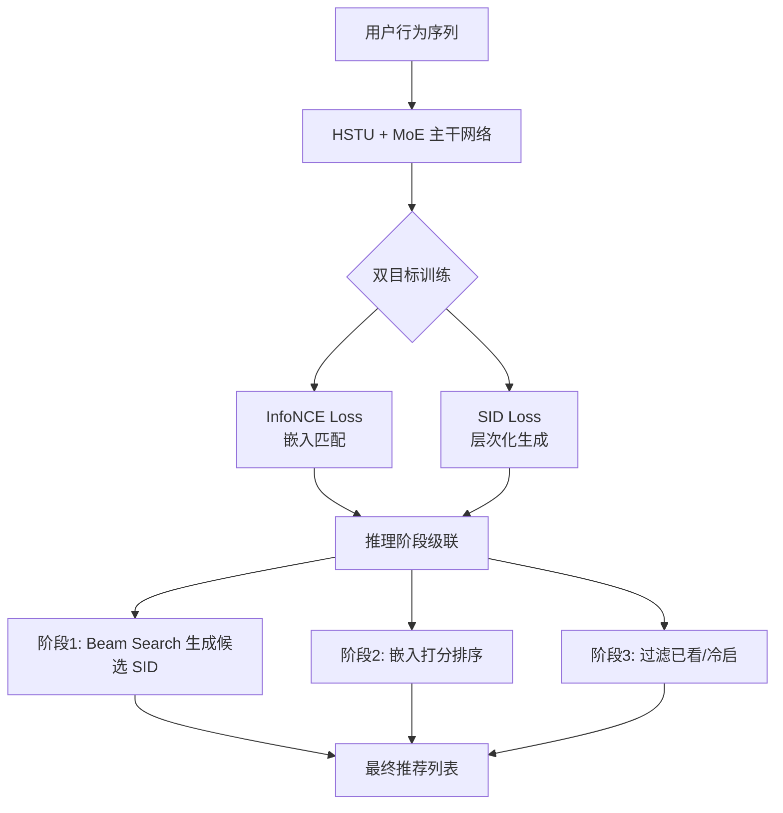

# OnePiece: The Great Route to Generative Recommendation

- **arXiv ID**: 2512.07424
- **原始链接**: [arXiv](https://arxiv.org/abs/2512.07424)
- **作者**: Jiangxia Cao, Shuo Yang, Zijun Wang, Qinghai Tan
- **机构**: 南京理工大学（NJUST）+ 腾讯算法大赛
- **发布时间**: 2025-12-08
- **更新时间**: 2025-12-08
- **学科分类**: cs.IR
- **本地PDF**: PDF（未公开）
- **代码**: （待查）
- **评级**: #rating/顶级
- **我的评语**: 广告场景多模态取代ItemID比较容易。位置编码有参考价值。

## 一句话总结

首次在推荐系统领域验证了生成式推荐同样遵循 Scaling Laws（规模法则），通过统一编码器-解码器框架将嵌入检索与自回归生成两种范式融合，在腾讯算法大赛中获奖。

## 可信度与工程价值分析

| 维度 | 评估 | 说明 |
|------|------|------|
| 机构属性 | 学术界 + 工业界 | 南京理工大学 + 腾讯算法大赛实践 |
| 数据集规模 | 超大 | 腾讯工业级数据集 TencentGR-100M |
| 代码开源 | 待查 | （arXiv 页面未提供）|
| 实验可信度 | 中等 | 工业数据验证，但实验规模有限（0.057B参数）|
| 潜在问题 | 规模法则未达 LLM 级别；多模态特征覆盖率仅 40% |

## 论文要解决什么问题

### 背景
- NLP 领域的 Scaling Laws 表明：模型参数量增加时，性能遵循幂律分布持续提升
- 传统推荐系统基于判别式模型（CTR预测），参数增加后边际收益递减
- 生成式推荐（预测下一个交互物品）被认为是下一代推荐范式

### 两种技术路线之争
1. **ANN 框架**：用压缩的用户嵌入在向量空间检索最近邻（如 Kuaiformer），效率高但全局建模能力有限
2. **自回归框架**：用 Beam Search 从整个物品空间解码（如 OneRec），推理成本高且易受热门物品干扰

### 论文切入点
- 探索生成式推荐是否也存在 Scaling Laws
- 能否将两种范式统一，兼得效率与表达能力

## 核心思路

OnePiece 提出**统一编码器-解码器框架**，同时验证两种范式的 Scaling Laws：

## 数据流转详解

### 训练阶段

1. **输入**：用户行为序列（含多模态特征）
2. **协同标记器**：将物品转化为离散 SID（语义ID）
   - 使用残差 K-means 聚类生成 SID
   - 贪婪重分配降低 SID 冲突率至 7.86%
3. **主干网络**：HSTU + MoE（7 张 H20 显卡）
   - HSTU：处理长序列时近线性复杂度
   - MoE：在有限计算资源下扩展模型容量
4. **双目标优化**：
   - $L_{total} = L_{con} + \lambda_1 L_{c1} + \lambda_2 L_{c2}$
   - InfoNCE：学习用户-物品向量表示
   - SID Loss：分层预测 sid1 → sid2

### 推理阶段

1. **阶段1（生成式检索）**：Beam Search 解码 Top-K 个潜在的 `(sid1, sid2)` 组合，然后通过映射字典**反向映射**找回真实的候选 Item Set。
2. **阶段2（嵌入式打分）**：用同一模型输出的用户嵌入与候选集进行点积打分，LogQ 脱偏，修正生成式的“排序不精”。
3. **阶段3（过滤）**：剔除已看物品和冷启动物品。

## 实验设置与结果

- **数据集**：TencentGR-100M（亿级）、10M
- **评价指标**：HitRate@10 (HR@10), NDCG@10
- **实验发现**：
  - **Scaling Laws 验证**：InfoNCE 和 SID 损失均严格遵循幂律（$R^2 > 0.9$）
  - **模型深度影响**：8层→40层，参数量 0.015B→0.057B，HR 和 NDCG 线性增长
- **竞赛成绩**：腾讯算法大赛初赛第10，复赛第9，决赛第13

## 前置工作 / 相关工作

| 工作 | 简介 | arXiv | 知识库 |
|------|------|-------|-------|
| Kuaiformer | ANN 框架的生成式推荐 | - | - |
| OneRec | 自回归框架的生成式推荐 | - | - |
| Scaling Laws (OpenAI) | LLM 规模法则 | - | - |

## 亮点与局限

### 亮点
1. **统一范式**：首次在一个框架内统一语义生成和嵌入检索
2. **实证 Scaling Laws**：为推荐领域投入更多算力提升效果提供理论依据
3. **高效推理**：级联推理解决生成式推荐推理慢、排序不准的痛点

### 局限
1. 规模仍有限（~0.07B），未达 LLM 级别
2. Tokenizer 效果高度依赖多模态特征质量（覆盖率仅 40%）
3. 竞赛数据可能存在过拟合风险

## 对后续研究的启发

1. **迈向大模型**：推荐系统未来可能像 NLP 一样出现统一的多模态基础模型
2. **端到端优化**：探索 Tokenizer 与推荐过程的差异化协同优化
3. **更大规模验证**：在十亿级参数上验证 Scaling Laws

## 术语表

| 术语 | 英文 | 解释 |
|------|------|------|
| Scaling Laws | 规模法则 | 模型性能与计算量、参数量遵循幂律关系 |
| 生成式推荐 | Generative Recommendation | 直接"生成"用户下一个想要的物品 |
| SID | Semantic ID | 物品的离散语义编码 |
| HSTU | Hierarchical Sequential Transducer Unit | 专为推荐设计的序列建模单元 |
| MoE | Mixture of Experts | 稀疏混合专家模型 |
| InfoNCE | - | 对比学习损失函数 |
| Beam Search | 束搜索 | 生成阶段保留最优候选路径的搜索算法 |

## 原始摘要

In past years, the OpenAI's Scaling-Laws shows the amazing intelligence with the next-token prediction paradigm in neural language modeling, which pointing out a free-lunch way to enhance the model performance by scaling the model parameters. In RecSys, the retrieval stage is also follows a 'next-token prediction' paradigm, to recall the hunderds of items from the global item set, thus the generative recommendation usually refers specifically to the retrieval stage (without Tree-based methods). This raises a philosophical question: without a ground-truth next item, does the generative recommendation also holds a potential scaling law? In retrospect, the generative recommendation has two different technique paradigms: (1) ANN-based framework, utilizing the compressed user embedding to retrieve nearest other items in embedding space, e.g, Kuaiformer. (2) Auto-regressive-based framework, employing the beam search to decode the item from whole space, e.g, OneRec. In this paper, we devise a unified encoder-decoder framework to validate their scaling-laws at same time. Our empirical finding is that both of their losses strictly adhere to power-law Scaling Laws ($R^2$>0.9) within our unified architecture.

## 插图引用

> 以下是论文的核心插图分析：

### 图 1: Scaling Laws 验证散点图
Scaling Laws 验证散点图（未公开）

**分析**：这是一组模型规模缩放法则图（Scaling Law Plots），展示了三种不同的损失函数（InfoNCE Loss、SID1 Loss 和 SID2 Loss）随模型参数量（Model Size，从 0.01B 到 0.07B）的变化趋势。图中的红色虚线是基于幂律（Power Law）公式的拟合曲线。统计指标显示 $R^2 > 0.9$，极高的拟合度证明了随着模型规模的扩大，这三种评价指标都呈现出稳定的下降趋势，实证了生成式推荐系统严格遵循幂律缩放原则。

### 图 2: OnePiece 训练阶段架构图
OnePiece 训练阶段架构图（未公开）

**分析**：该图展示了模型在训练阶段的架构。模型的核心是 DeepSeek MoE/HSTU，用于处理用户的长序列行为数据（长度为 101）。左上角的 Masked Cross-Attention（因果掩码矩阵）确保模型在预测时只能利用历史信息。模型采用多任务学习，包含预测下一个商品标识符的 Sid Softmax Loss，以及用于海量候选检索的 InfoNCE Loss（并采用 LogQ Debias 纠正流行度偏差）。

### 图 3: MoE 负载基尼系数监控图
MoE 负载基尼系数监控图（未公开）

**分析**：这是训练监控折线图，展示了模型中四个不同 MoE 层（Layer 0 到 Layer 3）的负载基尼系数（Load Gini）随训练步数的变化。引入 Auxiliary Loss（辅助损失）是为了防止“专家塌陷”（即路由器总是只选固定的几个专家）。图中的基尼系数保持在较低水平且没有大幅飙升，证明了计算资源在 MoE 层的专家间得到了均匀、高效的分配。

### 图 4: 级联推理流程图
级联推理流程图（未公开）

**分析**：该图展示了 OnePiece 模型在实际推理时的两阶段流程。Step 1（生成式检索阶段）：输入用户行为序列，通过 DeepSeek MoE/HSTU 提取特征，利用 Beam Search（波束搜索）在语义 ID（SID）空间快速筛选出 Top-256 的候选集。Step 2（嵌入式打分阶段）：将 TopK 的 SID 还原为具体物品，从 Faiss 向量库中提取对应向量，并利用 InfoNCE 进行对比打分排序，最终输出 Top-10 推荐结果。这展示了模型如何兼顾检索效率与推荐精度。

---

## 复查记录

- 2026-04-15 11:42 CST: 初始化论文目录并创建笔记骨架（根据 pdf 分析生成完整笔记）
