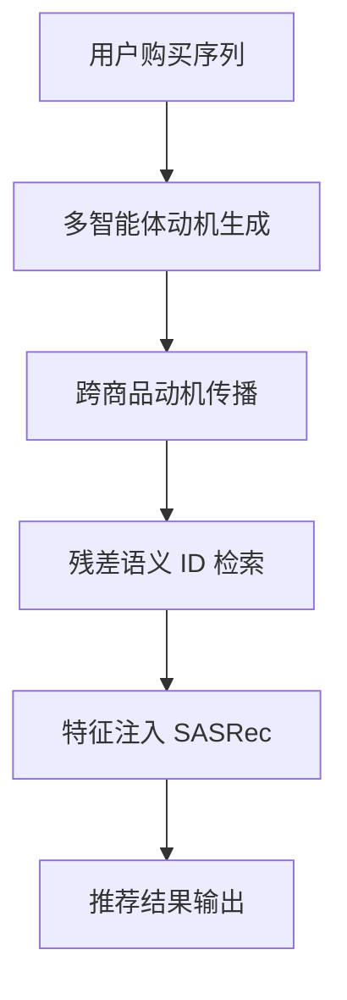

# MoMoREC: 面向残差语义ID感知的多智能体动机生成推荐框架

- **arXiv ID**: N/A（AAAI 2026）
- **原始链接**: [AAAI](https://ojs.aaai.org/index.php/AAAI/article/view/38623)
- **作者**: Yige Wang¹, Mingming Li¹, Li Wang¹, Kaichen Zhao¹, Wangming Li¹, Weipeng Jiang², Xueying Li¹*
- **机构**: 阿里巴巴淘天集团（淘宝天猫）+ 西安交通大学
- **发布时间**: 2026-03
- **学科分类**: 推荐系统、LLM应用
- **本地PDF**: PDF（未公开）
- **代码**: （未提供）
- **评级**: #rating/人上人
- **我的评语**: 大概介绍了Multi-Agent视频推荐的一些方法，可以作为参考，但没有看到特别有价值能马上的落地的点。

## 一句话总结

> MoMoREC 提出了一个基于 LLM 的多智能体推荐框架，通过离线生成用户购买动机并利用“残差语义 ID”技术将其转化为低维离散特征，成功实现了大模型语义理解与传统高并发推荐系统的低成本集成。

## 可信度与工程价值分析

| 维度 | 评估 | 说明 |
|------|------|------|
| **工业背景** | 极高 | 阿里巴巴淘天集团出品，针对淘宝真实业务场景优化 |
| **落地潜力** | 高 | 采用特征注入而非端到端生成，在线推理延迟仅增加 7.9% |
| **实验效果** | 显著 | 在亚马逊数据集上 Recall 提升巨大，在线 A/B 测试 GMV +6.3% |
| **代码开源** | 无 | 暂无开源代码 |

## 论文要解决什么问题

### 研究背景
- LLM 在推荐系统中主要用于增强物品嵌入，但计算开销大。
- 视频/电商推荐中，理解用户“为什么买”比“买了什么”更重要。

### 现有方法的瓶颈
1. **动机理解不足**：现有模型能捕捉行为模式，但缺乏对深层动机（Motivation）的显式建模。
2. **嵌入不兼容**：LLM 的高维稠密向量与推荐系统的低维离散 ID 难以高效融合。
3. **推理开销巨大**：直接使用生成式 LLM 排序会导致延迟过高（通常 >10x）。

## 核心思路

MoMoREC 的核心是**“语义解耦与特征注入”**。它将 LLM 作为离线特征提取器，通过三个关键步骤完成：

1. **动机生成**：用多智能体协作生成商品对背后的动机文本。
2. **动机传播**：通过语义聚类将高频商品的动机赋予长尾商品，解决稀疏性。
3. **残差语义 ID**：通过多层残差量化（Residual Quantization）将动机向量转换为 6-8 位的离散 ID 序列。

## 数据流转详解

### 训练/特征生成阶段
1. **输入**：用户共购商品对 -> LLM 分析智能体（生成描述）-> 总结智能体（提炼短语）-> 判断智能体（ELO 选优）。
2. **传播**：利用 LSH 对商品嵌入进行快速检索，将有动机商品的语义传播给无动机的长尾商品。
3. **压缩**：对动机向量执行 N 层 K-means 聚类，每一层记录中心点 ID 并将残差传给下一层。
4. **输出**：每个商品获得一组离散 ID（如 `[42, 7, 129...]`）。

### 推理阶段
1. **输入**：用户当前行为序列的商品 ID。
2. **检索**：查表获得商品的原始 ID 嵌入和新注入的“残差语义 ID”嵌入。
3. **排序**：模型（SASRec/DIN 等）融合两种嵌入进行打分。

## 实验设置与结果

- **数据集**：Amazon Beauty, Video Game, Baby Product
- **指标**：Recall@10, MRR@10, Precision@10
- **对比**：SASRec, LLMESR, RLMRec, AlphaFuse
- **主要发现**：
  - 在 Baby 数据集上 Recall 提升超过 10 倍。
  - **推理效率**：相比基线 SASRec，推理时间仅增加 7.9%，远优于直接调用 LLM。

## 亮点与局限

### 亮点
- **工程化思维**：不改变现有推荐架构，只增加一组极低维度的语义 ID 特征，成本极低。
- **残差量化**：巧妙解决了语义损失问题。

### 局限
- **离线依赖**：无法实时生成新出现的商品/动机组合。
- **评语**：正如评价所说，虽然框架完整，但对如何动态捕捉即时动机（Contextual Motivation）仍有欠缺。

## 对后续研究的启发
- 如何在不重训模型的情况下动态更新“动机码本”。
- 考虑将残差 ID 技术应用到其他多模态推荐场景。

## 术语表
- **MoMoREC**: Motivation Generation Framework for Residual Semantic ID-Aware Recommendation
- **Residual Quantization**: 残差量化，将向量逐层分解为 ID 的技术。

---
复查记录：
- 2026-04-13：初稿完成，按照标准格式重构，删除失效图片引用。
