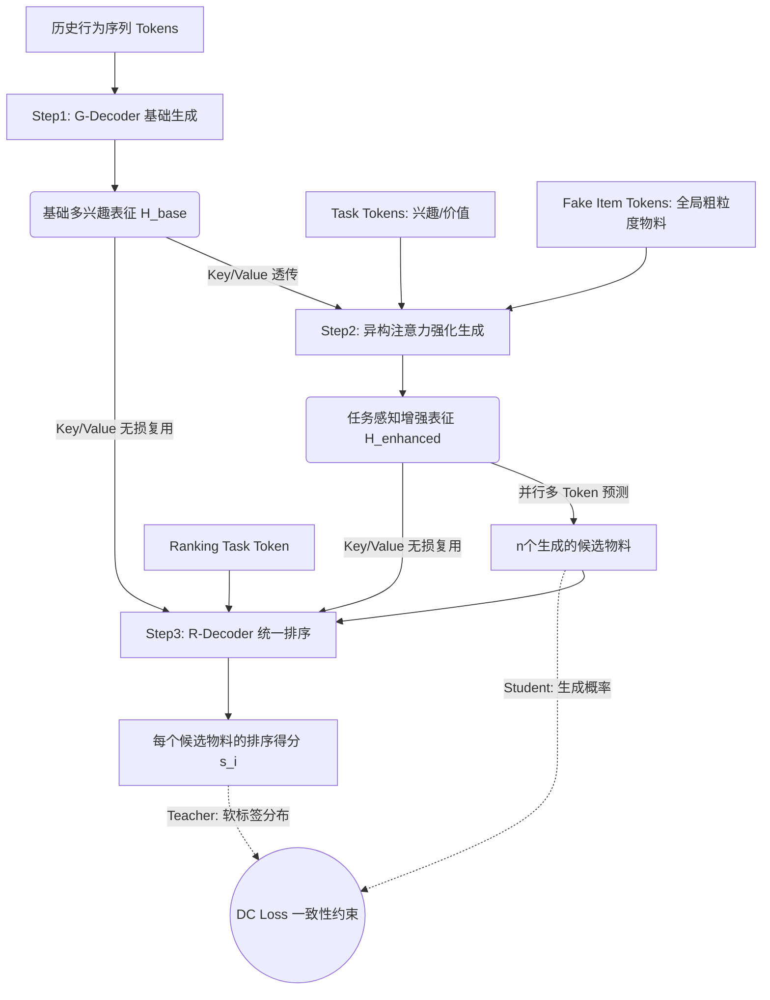

# OneRanker: Unified Generation and Ranking with One Model in Industrial Advertising Recommendation

- **arXiv ID**: 2603.02999
- **原始链接**: [arXiv](https://arxiv.org/abs/2603.02999)
- **作者**: Dekai Sun, Yiming Liu, Jiafan Zhou, Xun Liu, Chenchen Yu, Yi Li, Jun Zhang, Huan Yu, Jie Jiang
- **机构**: Tencent Inc. (腾讯)
- **发布时间**: 2026-03
- **学科分类**: 推荐系统、生成式模型
- **本地PDF**: PDF（未公开）
- **代码**: （未提供）
- **评级**: 待评
- **我的评语**: 待添加

## 一句话总结

> OneRanker 提出了一种端到端的推荐架构，通过引入任务 Token 和分布一致性损失，将候选生成和精细排序深度耦合在一个 Transformer 模型中，彻底解决了传统两阶段系统中目标错位和信息损失的痛点，并在腾讯广告系统全量上线取得显著 GMV 提升。

## 可信度与工程价值分析

| 维度 | 评估 | 说明 |
|------|------|------|
| **工业背景** | 极高 | 腾讯团队出品，针对微信渠道广告真实业务场景的架构升级 |
| **落地潜力** | 极高 | 已在腾讯生产环境全量上线，证明了工程可行性和容错率 |
| **实验效果** | 显著 | 在线 A/B 测试中核心商业指标 GMV-Normal 提升了 +1.34% |
| **架构创新** | 高 | 用“架构整合”替代“阶段解耦”，提出了 Token-based 多任务协调机制 |

## 论文要解决什么问题

### 传统“先生成，后排序” (Generate-then-Rank) 范式的核心痛点：

1. **兴趣目标与商业价值的错位 (Misalignment)**：
   - 生成任务（召回）通常优化用户偏好（如点击率）。
   - 排序任务通常优化商业价值（如 GMV、eCPM）。
   - 如果分阶段执行，生成阶段容易过滤掉大量高价值但与历史行为不完全一致的物料，造成不可逆的价值流失。

2. **生成过程的目标无感知 (Target-agnostic generation)**：
   - 生成候选序列时，用户的表征是静态的，无法提前“预见”待生成的具体候选物料。这限制了模型在广告等高度依赖意图动态匹配的场景下的表现。

3. **两阶段断连带来的三重问题 (Disconnection)**：
   - **表示不一致**：生成模型和排序模型使用不同的表示空间，导致语义漂移。
   - **计算冗余**：用户特征（尤其长序列）需要被重复计算。
   - **错误传播**：上游的生成偏差无法在下游被纠正。

## 核心思路

OneRanker 不是简单把两个模型拼接，而是**用一个统一的模型架构实现生成和排序的深度融合**。其核心机制包括：

1. **价值感知的多任务解耦**：在生成阶段，引入独立的 `Task Token` 来区分兴趣（点击）和价值（GMV），在底层共享特征的同时，在上层隔离优化目标，缓解目标冲突。
2. **粗细粒度结合的目标感知**：引入 `Fake Item Tokens`（代表全量物料的聚类中心）让模型在生成前具有“粗粒度”的全局物料感知；在排序阶段，直接对真实物料进行“精细粒度”感知。
3. **输入输出双侧一致性**：
   - **输入侧透传**：排序阶段的 Key/Value 直接复用生成阶段的中间表征，确保信息无损流转。
   - **输出侧约束**：引入**分布一致性损失 (Distributional Consistency Loss, DC Loss)**，将排序器视为 Teacher，强迫生成器的候选概率分布向排序器的打分分布对齐。

## 数据流转详解

三个逻辑步骤被深度耦合在一个前向计算网络中：

1. **输入**：用户历史行为序列（U/C/X/I Tokens）。
2. **Step 1 (基础生成)**：输入 G-Decoder，产出底层的用户多兴趣表征。
3. **Step 2 (增强生成)**：
   - `Task Tokens` 和 `Fake Item Tokens` 作为 Query，Step 1 的输出作为 Key/Value 进行注意力计算。
   - 产出增强表征后，并行生成 $n$ 个候选物料。
4. **Step 3 (统一排序)**：
   - 专用的 `Ranking Task Token` 和刚生成的 $n$ 个候选物料作为 Query。
   - **核心**：Step 1 和 Step 2 的表征共同作为 Key/Value 供排序器复用。
   - 对 $n$ 个候选输出最终打分。
5. **联合优化**：同时使用生成的负对数似然损失、排序的 BPR Pairwise 损失以及用来对齐两者的 DC Loss 进行端到端训练。

## 实验设置与结果

- **数据集**：腾讯广告与内容场景的大规模真实工业数据集。
- **基线模型**：HSTU (Meta)、GPR (Tencent) 等顶级工业生成推荐模型。
- **离线效果**：HR@1 相比 GPR 提升 44.7%，NDCG@15 提升 10.2%。
- **消融实验**：去掉 DC Loss 或 Key/Value 注入（输入侧一致性）会导致性能急剧下降，证明了闭环设计至关重要。
- **在线 A/B 测试**：在腾讯微信广告系统进行，核心商业指标 **GMV-Normal 提升 +1.34%**，消耗提升 +0.72%。已全量上线。

## 对后续研究的启发

1. **架构重构代替模块堆叠**：通过在 Attention 层面对 Key/Value 进行复用和重新路由，彻底打破了召回和排序的物理隔离。
2. **Tokenization as Interface**：将“优化目标”（Task）和“全局物料知识”（Fake Item）全部 Token 化并作为 Query 参与注意力计算，这是一种极具扩展性的 LLM 范式在传统推荐上的应用。
3. **分布对齐的梯度桥梁**：DC Loss 充当了排序向召回反向传导价值梯度的“软桥梁”，解决了离散候选生成无法直接反向传播的问题。

## 13. 插图引用

### 图 1: OneRanker 核心模型架构
模型架构（未公开）

**分析**：
OneRanker 的整体架构主要由一个输入层和三个递进的处理模块构成，实现了从基础序列建模到多任务感知的统一排序：

*   **输入 (Input)**：模型底层的输入是包含用户、上下文、特征和物品（$U, C, X, I$）的用户行为序列 (User behavior Token)。
*   **Step 1: 基础生成 (Base Generation)**：通过多层 G-Decoder Block 对用户行为序列进行编码，提取基础的上下文表征，并将其作为 Key/Value 向量传递给后续模块。
*   **Step 2: 多任务/目标感知增强 (Multi-task/target Aware)**：这是实现多任务协同的核心步骤。该模块引入了两类特殊的 Token：**任务 Token (Task Token, $T_i$)** 和通过对真实物品 K-means 聚类生成的**伪物品 Token (Fake Item Token, $F_i$)**。
    *   **Token 交互机制**：在该模块的 Transformer 结构中，Task Token 与 Fake Item Token 通过特定的掩码机制（Mask）进行 Self-attention 交互，同时与 Step 1 的基础表征进行 Cross-attention。
    *   如图右侧细节所示，Task Token ($T_v$) 会与多个 Fake Item Token ($F_k$) 通过 MLP 和池化操作进行深度融合，生成特定任务的表征头 (Head-v)。最终，这些包含任务意图和全局物品分布信息的 Head 会与真实的候选物品 ($I$) 结合，生成具备多任务感知能力的物品表征。
*   **Step 3: 统一排序 (Unified Ranking)**：排序模块 (R-Decoder Block) 接收特定的排序任务 Token ($T_r$) 和候选物品列表 ($I_1...I_n$)，综合 Step 1 的基础序列信息和 Step 2 输出的多任务感知特征，最终计算并输出各项候选物品的排序得分 ($S_1...S_n$)。

**总结**：该架构的精妙之处在于 **Step 2**，它通过引入宏观的“伪物品 (Fake Item)”作为桥梁，让“任务 (Task)”能够动态地感知全局物品的分布特征，从而在最终的 **Step 3** 中实现更精准的个性化排序。

---
复查记录：
- 2026-04-13：从 PDF 源文件重现并更新核心架构图。
- 2026-04-13：初稿完成，按照标准 14 点格式完全重写，强调了模型融合与数据流转过程。
